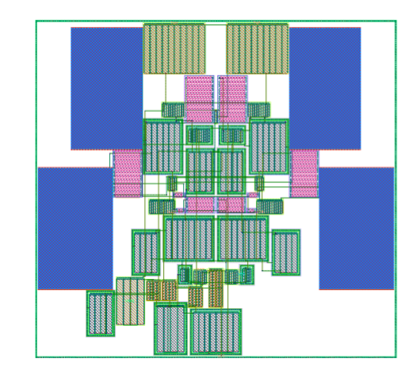
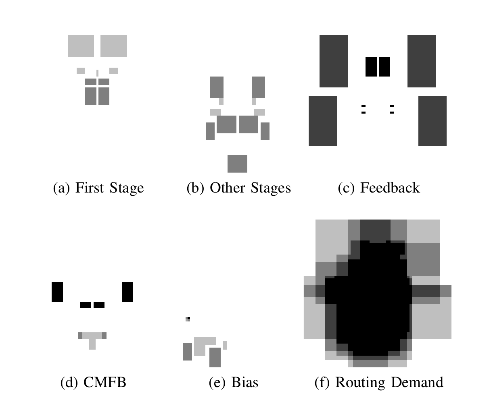

# Feature Extraction #
This python script outputs the extracted images based on the feature proposed. \
To extract the corresponding features for each circuit, run the script under UT-Anlay:
```
python  extract_feature.py
```

### Output Feature Images ###
The extracted images would by default be saved to the corresponding layout folders under ./../benchmark/. In total 6 images would be extracted:

- nets.png: Aggregated routing demand map based on pin boundary box of each net.
- first_stage.png: Devices in the first amplifier stage. 
- other_stage.png: Devices in other amplifier stages.
- fb.png: Devices in the compensention feedback loop.
- cmfb.png: Devices in the common-mode feedback circuits.
- bias.png: Devices in the bias circuits.

The device type information would be automatically embedded with image intensity:

| Device Type     | NMOS | PMOS | CAP  | RES  |
|:---------------:|:----:|:----:|:----:|:----:|
| Image Intensity | 0.25 | 0.50 | 0.75 | 1.00 |

For the routing demand map, a higher image intensity indicate higher probability of a wire routing to be routing across the location.
Below is the example of the extracted features in comparison with the generated layout.

 

Due to NDA issues, we can not directly share the layout GDSII files.


